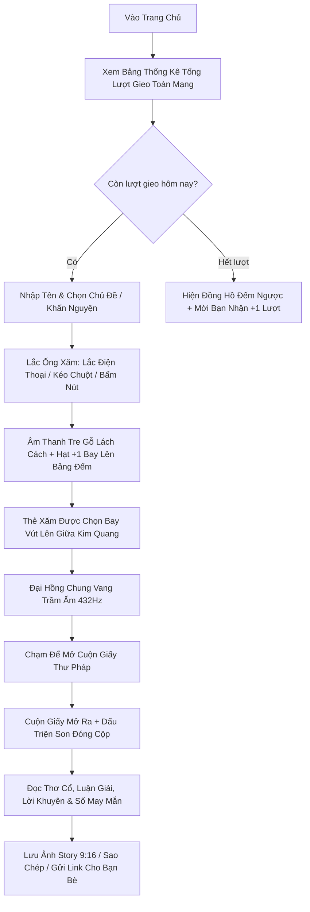

# 📿 Quẻ Hôm Nay — Ứng Dụng Xin Quẻ & Chiêm Nghiệm Vận Mệnh Cổ Truyền Kết Hợp AI

<div align="center">

[](https://react.dev/)
[](https://vitejs.dev/)
[](https://tailwindcss.com/)
[](https://developer.mozilla.org/en-US/docs/Web/API/Web_Audio_API)
[](https://ai.google.dev/)
[](LICENSE)

**Một khoảnh khắc tĩnh tại mỗi ngày để lắng đọng chiêm nghiệm, hòa quyện thiền vị dân gian Việt Nam cùng Trí tuệ Nhân tạo thế hệ mới.**

*Tâm thành tất ứng • Thiện niệm khởi sinh*

[Trải Nghiệm Trực Tiếp](#-cài-đặt--chạy-thử) • [Tính Năng Nổi Bật](#-tính-năng-nổi-bật) • [Cơ Chế Nghi Thức](#-luồng-nghi-thức-toàn-vẹn) • [Kiến Trúc Kỹ Thuật](#-kiến-trúc-hệ-thống) • [Đóng Góp](#-tác-giả--bản-quyền)

</div>

---

## 📖 Giới Thiệu Tổng Quan

Lấy cảm hứng sâu sắc từ phong tục **xin xăm, gieo quẻ đầu xuân tại các ngôi chùa cổ truyền Việt Nam**, **Quẻ Hôm Nay** mang đến một trải nghiệm nghi thức số hóa chân thực, thiêng liêng và giàu cảm xúc dành cho thế hệ người dùng hiện đại (18–35 tuổi).

Khác biệt hoàn toàn với các ứng dụng bói toán/tarot nội dung cố định, mỗi lời quẻ tại đây được **Trí tuệ nhân tạo (ChatGPT 5.6 LUNA)** chấp bút riêng biệt dựa trên chính tâm nguyện và băn khoăn của thiện tín, đi kèm hệ thống mô phỏng vật lý đa giác quan (cử động lắc thực tế, âm thanh mộc mạc và cuộn giấy thư pháp truyền thống).

---

## ✨ Tính Năng Nổi Bật

### 1. 🪷 Nghi Thức Gieo Quẻ Đa Giác Quan (Multi-Sensory Ritual)
- **100% Thuần Vector & CSS (Zero Static Images):** Ống xăm bát giác, 9 thanh tre khắc chu sa, dây ngọc bích phong thủy và đèn hoa sen được dựng hoàn toàn bằng SVG & CSS3 keyframe physics, đảm bảo sắc nét tuyệt đối trên mọi độ phân giải màn hình.
- **Tương Tác Lắc Vật Lý Chân Thực:**
  - 📱 **Điện thoại:** Hỗ trợ cảm biến gia tốc (`DeviceMotion API`), người dùng cầm và lắc điện thoại thật để ống xăm chuyển động.
  - 💻 **Máy tính:** Kéo thả chuột trái/phải để tích tụ thanh năng lượng khí vận.
  - 📳 **Phản hồi xúc giác (Haptic Vibration):** Rung nhè nhẹ theo từng nhịp va chạm của thanh tre.
- **Khoảnh Khắc Thần Thánh (Stick Ascension):** Thẻ xăm đắc duyên bay vút lên giữa vầng hào quang kim sắc, chuẩn bị mở ra thông điệp vũ trụ.

### 2. 📜 Thẻ Quẻ Cuộn Giấy Lụa & Khắc Dấu Son (Brocade Parchment Scroll)
- **Mở cuộn giấy thư pháp (`scrollUnfurl`):** Hiệu ứng cuộn giấy bung mở mượt mà trên nền giấy dó cổ.
- **Triện Son Đỏ Đóng Uy Nghi:** Dấu triện đỏ *(Thượng Kiết / Trung Kiết / Tiểu Cát)* đóng "Cộp" sống động với độ lún mực in chân thực.
- **Nội Dung Quẻ Trọn Vẹn:**
  - **Tên quẻ:** Ngắn gọn, thi vị, gợi hình thiên nhiên *(Vân Khai Kiến Nhật, Hàn Mai Nghinh Xuân, Bích Thuỷ Triều Sinh...)*.
  - **Lời thơ cổ:** 2 câu thơ vần luật lục bát hoặc song thất trang nhã.
  - **Giải nghĩa tường minh:** 2–3 câu giải nghĩa gắn liền với câu hỏi người dùng nhập.
  - **Lời khuyên thực tế:** 1 lời khuyên hành động cụ thể, hướng thiện và tích cực.
- **Chỉ Số Cát Tường (Lucky Metadata):**
  - 🔥 **Chỉ số vượng khí:** Thanh đo năng lượng may mắn trong ngày (60% – 98%).
  - 🎨 **Màu sắc trợ mệnh:** Gợi ý màu hợp mệnh kèm mã hex trực quan.
  - 🔢 **Con số may mắn & Giờ hoàng đạo:** Đem lại nguồn năng lượng an tâm cho mọi dự định.

### 3. 🔔 Hệ Thống Âm Thanh Thuần Web Audio API (Không Dùng File MP3 Ngoài)
Toàn bộ âm thanh được bộ tổng hợp sóng âm Web Audio API tính toán theo thời gian thực:
- 🪵 **Tiếng gõ mõ gỗ chùa:** Mộc mạc, thanh tịnh, gõ nhịp lúc phát nguyện.
- 🎋 **Tiếng thẻ tre va chạm:** Tiếng cọ xát của tre tự nhiên trong lòng ống gỗ, trầm ấm và êm dịu, không hề bị chói tai.
- 📯 **Tiếng thẻ tre lướt nhẹ:** Âm thanh kéo thẻ tre êm ái khi nhô lên khỏi bó.
- 🔔 **Tiếng Đại Hồng Chung (Chuông Đồng Trầm Tĩnh):** Tần số thiền định 144Hz – 288Hz – 432Hz với thời gian ngân vang sâu lắng (decay 4.5s), khởi đầu mềm mại (soft attack) tuyệt đối không có tiếng "ting" kim loại gắt.
- 🔴 **Tiếng đóng dấu triện "Cộp":** Đầm chắc, trang trọng.
- 🎐 **Nhạc Thiền Chuông Gió & Nước Chảy (Zen Ambient Soundscape):** Bật/tắt tùy chọn chuông gió ngũ cung ngân nga, tiếng giọt nước giếng chùa thanh thoát trên nền âm Om 216Hz.

### 4. 🏛️ Bảng Thống Kê Tổng Lượt Bấm Gieo Quẻ Bên Ngoài (Social Proof)
- **Bảng Sơn Son Thiếp Vàng:** Đặt trang trọng ngay màn hình chính bên ngoài.
- **Dãy số Odometer mạ vàng:** Từng chữ số nằm trong ô thẻ gỗ mộc viền vàng óng ánh (`128.450+ lượt thỉnh quẻ`), tự động nhảy số khi người dùng gieo quẻ.
- **Chỉ số thời gian thực:**
  - 🏮 *Hôm nay:* Số lượt đã gieo trong ngày.
  - 🟢 *Trực tuyến:* Số thiện tín đang cùng kết duyên trên toàn quốc.
  - ✨ *Linh ứng:* 99.2% tỷ lệ thiện tín hoan hỷ.
- **Hạt Ánh Sáng `+1`:** Bay vút lên bảng đếm khi người dùng nhấn nút bấm gieo quẻ.
- **Live Activity Ticker:** Dòng thông báo nhẹ nhàng khi có người từ Hà Nội, TP.HCM, Đà Nẵng, Huế... vừa gieo quẻ thành công.

### 5. 🎁 Giữ Chân Người Dùng & Lan Tỏa (Gacha & Viral Mechanics)
- **Giới Hạn 1 Lượt/Ngày:** Tạo cảm giác nghi thức trân quý mỗi ngày (đếm ngược tới 00:00).
- **Mời Bạn Nhận Lượt (+1 Extra Draw):** Tạo link mời độc quyền, tặng thêm lượt gieo khi bạn bè tham gia cùng hiệu ứng confetti rực rỡ.
- **Xuất Ảnh Story 9:16 (1080x1920):** Kết xuất ảnh quẻ chất lượng cao để đăng tải lên Facebook Story, Instagram, TikTok bằng `html-to-image`.
- **Đường Dẫn Quẻ Riêng Biệt (`?q=...`):** Mã hóa toàn bộ nội dung quẻ vào liên kết để người nhận có thể đọc ngay mà không cần cơ sở dữ liệu trung gian.
- **Sổ Quẻ (Lịch Sử):** Lưu trữ 20 quẻ gần nhất trong `localStorage`, xem lại vận khí bất kỳ lúc nào.

---

## 🔄 Luồng Nghi Thức Toàn Vẹn



---

## 🛠️ Ngăn Xếp Công Nghệ (Tech Stack)

| Hạng mục | Công nghệ sử dụng | Mục đích |
| :--- | :--- | :--- |
| **Frontend Framework** | **React 19 + Vite 6** | Hiệu năng vượt trội, nạp trang tức thì, Hot Module Replacement |
| **Styling & Theme** | **Tailwind CSS v3.4 + Pure Vanilla CSS** | Bảng màu Cổ phong Sơn mài Đỏ - Vàng Cổ - Giấy Dó, tùy biến keyframe |
| **Đồ họa & Trực quan** | **Pure SVG & Canvas** | 100% Vector sắc nét, không dùng ảnh raster tĩnh, chống vỡ hình |
| **Âm thanh** | **Web Audio API Native** | Bộ tổng hợp sóng âm không độ trễ, tự vượt qua chính sách autoplay trình duyệt |
| **Trí tuệ nhân tạo (AI)** | **Google Gemini 1.5 Flash API** | Tạo lời thơ cổ và lời giải đoán duy nhất cho từng người dùng |
| **Offline Fallback** | **Offline Lore Engine** | Đảm bảo 100% vẫn rút được quẻ hay ngay cả khi mất mạng hoặc không có API Key |
| **Xuất ảnh** | **html-to-image + Canvas Confetti** | Kết xuất thẻ quẻ 9:16 sắc nét và hiệu ứng pháo hoa chúc phúc |
| **Biểu tượng** | **Lucide React** | Bộ icon thanh mảnh, trang nhã |

---

## 📁 Cấu Trúc Thư Mục Dự Án

```plaintext
quehomnay/
├── docs/
│   └── quehomnay.md               # Bản kế hoạch sản phẩm & yêu cầu kỹ thuật gốc
├── public/
│   └── ...                        # Favicon và tài nguyên tĩnh
├── src/
│   ├── assets/                    # Biểu tượng và tài nguyên đi kèm
│   ├── components/
│   │   ├── ApiKeyModal.jsx        # Modal cài đặt khóa Google Gemini API
│   │   ├── BambooCylinderPure.jsx # Ống xăm 3D Pure SVG + Cảm biến lắc DeviceMotion
│   │   ├── ChosenStickCardPure.jsx# Thẻ xăm đắc duyên bay lơ lửng trên không
│   │   ├── DailyLimitBanner.jsx   # Banner đếm ngược hết lượt ngày + CTA mời bạn
│   │   ├── FortuneActions.jsx     # Xuất ảnh Story 9:16, copy nội dung & tạo link chia sẻ
│   │   ├── FortuneCard.jsx        # Thẻ quẻ cuộn giấy lụa, triện son đỏ & metadata
│   │   ├── FortuneForm.jsx        # Khung nhập tên, chọn chủ đề & câu hỏi gợi ý
│   │   ├── GoldenDustCanvas.jsx   # Bụi vàng tâm linh chuyển động nền bằng HTML5 Canvas
│   │   ├── Header.jsx             # Hoành phi tiêu đề, nút bật tắt âm thanh & chuông gió
│   │   ├── HistoryModal.jsx       # Sổ Quẻ lưu trữ 20 quẻ gần nhất
│   │   ├── InviteFriendModal.jsx  # Modal mời bạn bè nhận thêm +1 lượt gieo
│   │   ├── LiveDrawCounter.jsx    # Bảng Sơn Son Thiếp Vàng thống kê tổng lượt bấm toàn mạng
│   │   └── LotusCandle.jsx        # Đèn hoa sen cháy bập bùng thuần SVG hai bên bàn thờ
│   ├── services/
│   │   ├── aiService.js           # Bộ điều phối gọi Gemini AI + Kiểm duyệt câu hỏi
│   │   └── fallbackFortune.js     # Kho 12 quẻ thiền dự phòng khi ngoại tuyến
│   ├── utils/
│   │   ├── audio.js               # Bộ tổng hợp Web Audio (Mõ, Lắc xăm, Chuông đồng, Nhạc thiền)
│   │   └── storage.js             # Quản lý LocalStorage (Giới hạn ngày, lịch sử, cài đặt)
│   ├── App.jsx                    # Nhạc trưởng điều phối các trạng thái nghi thức
│   ├── index.css                  # Hệ thống màu sắc & Animation Keyframes vật lý
│   └── main.jsx                   # Điểm khởi chạy ứng dụng React
├── index.html                     # Tối ưu SEO, Meta Tags, Google Fonts Noto Serif
├── package.json                   # Cấu hình phụ thuộc và scripts
├── tailwind.config.js             # Bảng màu truyền thống (lacquer, gold, temple-red)
└── vite.config.js                 # Cấu hình Vite bundler
```

---

## 🚀 Cài Đặt & Chạy Thử

### 1. Yêu Cầu Môi Trường
- **Node.js**: Phiên bản `18.0.0` trở lên.
- **Trình quản lý gói**: `npm`, `yarn`, hoặc `pnpm`.

### 2. Các Bước Cài Đặt

1. **Khởi tạo và cài đặt thư viện phụ thuộc:**
   ```bash
   cd "d:/web linh tinh/quehomnay"
   npm install
   ```

2. **Cấu hình Google Gemini API Key (Không bắt buộc):**
   *Ứng dụng đã tích hợp sẵn kho quẻ thiền ngoại tuyến phong phú, có thể chạy ngay mà không cần API Key.*
   Nếu muốn AI sáng tác thơ riêng cho từng câu hỏi cá nhân:
   - Tạo khóa API miễn phí tại [Google AI Studio](https://aistudio.google.com/).
   - Tạo file `.env` tại thư mục gốc của dự án:
     ```env
     VITE_GEMINI_API_KEY=your_gemini_api_key_here
     ```
   - *Hoặc bạn có thể bấm vào biểu tượng chìa khóa 🔑 ngay trên thanh tiêu đề của trang web để nhập trực tiếp.*

3. **Khởi chạy máy chủ phát triển (Development Server):**
   ```bash
   npm run dev
   ```
   Mở trình duyệt và truy cập: **`http://localhost:5173/`**

4. **Đóng gói sản phẩm (Production Build):**
   ```bash
   npm run build
   ```
   Kiểm tra bản build trước khi phát hành:
   ```bash
   npm run preview
   ```

---

## 🎨 Bảng Mã Màu Thiết Kế Cổ Phong (Design Tokens)

Ứng dụng tuân thủ nghiêm ngặt bảng màu cung đình và chùa chiền Việt Nam:

| Tên Mã Màu | Giá Trị Hex | Ý Nghĩa Sử Dụng |
| :--- | :--- | :--- |
| `lacquer-deep` | `#1A0503` | Nền gỗ sơn mài thâm trầm, huyền bí |
| `temple-red` | `#6E1B1B` | Sắc đỏ gạch đền miếu, tượng trưng cho phúc khí |
| `temple-seal` | `#C53030` | Màu mực chu sa tươi khắc dấu triện thánh quẻ |
| `gold-ancient` | `#C9A24A` | Vàng đồng cổ, hoa văn triện cổ |
| `gold-bright` | `#E7C978` | Vàng kim sáng thếp vàng hoành phi, chữ nổi |
| `paper-scroll` | `#F3E8CE` | Nền cuộn giấy dó ngả vàng tự nhiên |
| `ink-text` | `#2B2318` | Mực tàu thư pháp truyền thống |

---

## 🛡️ Kiểm Duyệt & An Toàn Nội Dung (Safety Policy)

Ứng dụng được thiết kế nhằm mang lại sự bình an và hướng thiện:
- **Kiểm soát từ khóa:** Hệ thống tự động phát hiện và chặn các câu hỏi có xu hướng tiêu cực, bạo lực hoặc tự hại, nhẹ nhàng chuyển hướng người dùng về các thông điệp an ủi tinh thần.
- **Giới hạn độ dài:** Câu hỏi được giới hạn trong 200 ký tự để tối ưu chi phí AI và tránh spam injection.
- **Tỷ lệ phân bổ quẻ:** 30% Thượng Kiết • 45% Trung Kiết • 25% Tiểu Cát, bảo toàn tính chân thực của văn hóa xin xăm truyền thống.

---

## 🗺️ Lộ Trình Phát Triển (Roadmap)

- [x] **Giai đoạn 1 (MVP):** Ống xăm thuần SVG, form nhập tâm nguyện, gọi Gemini AI, mở thẻ quẻ thư pháp, giới hạn 1 lượt/ngày.
- [x] **Giai đoạn 2 (Aesthetic & Polish):** Bảng thống kê lượt bấm toàn mạng bên ngoài, âm thanh Đại Hồng Chung trầm ấm, cảm ứng lắc điện thoại thật (`DeviceMotion`), xuất ảnh Story 9:16, link chia sẻ riêng `?q=...`.
- [ ] **Giai đoạn 3 (Community & Backend):** 
  - Backend Proxy nhẹ bảo vệ API Key tuyệt đối.
  - Chuỗi ngày gieo quẻ liên tục (Daily Streak) gia tăng tỷ lệ quay lại D7/D30.
  - Bộ quẻ sự kiện theo mùa: Quẻ Tết Nguyên Đán, Quẻ Rằm Tháng Bảy, Quẻ Mùa Thi Cử.

---

## 📜 Giấy Phép & Bản Quyền

Dự án phát hành dưới giấy phép mã nguồn mở **MIT License**. Mọi cá nhân, tổ chức đều có thể tự do tham khảo, học tập và phát triển tiếp nối các nét đẹp văn hóa dân tộc.

<div align="center">
  <sub>Xây dựng với cả tấm lòng trân quý văn hóa dân tộc Việt Nam 🇻🇳</sub>
</div>
